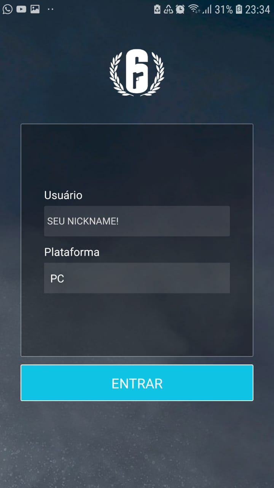

<h1 align="center">
    
</h1>

<h4 align="center">
  R6 Stats App
</h4>

  

  
  
  

  

  

  <a href="#rocket-tecnologias">Technologies</a>&nbsp;&nbsp;&nbsp;|&nbsp;&nbsp;&nbsp;
  <a href="#-projeto">Project</a>&nbsp;&nbsp;&nbsp;|&nbsp;&nbsp;&nbsp;
  <a href="#-como-contribuir">How to contribute</a>&nbsp;&nbsp;&nbsp;|&nbsp;&nbsp;&nbsp;
  <a href="#memo-licença">License</a>

 

  

## :rocket: Tecnologies

This project was developed with the following technologies

- [React Native](https://facebook.github.io/react-native/)

## 💻 Project

This APP was created to make easy to access your Rainbow Six Siege account stats

## 🤔 How to contribute

- Faça um fork desse repositório;
- Cria uma branch com a sua feature: `git checkout -b minha-feature`;
- Faça commit das suas alterações: `git commit -m 'feat: Minha nova feature'`;
- Faça push para a sua branch: `git push origin minha-feature`.

Depois que o merge da sua pull request for feito, você pode deletar a sua branch.

## :memo: License

This project is under MIT license. See the file [LICENSE](LICENSE) for more details.

---

[Visit my website!](https://www.ggportfolio.com.br)
